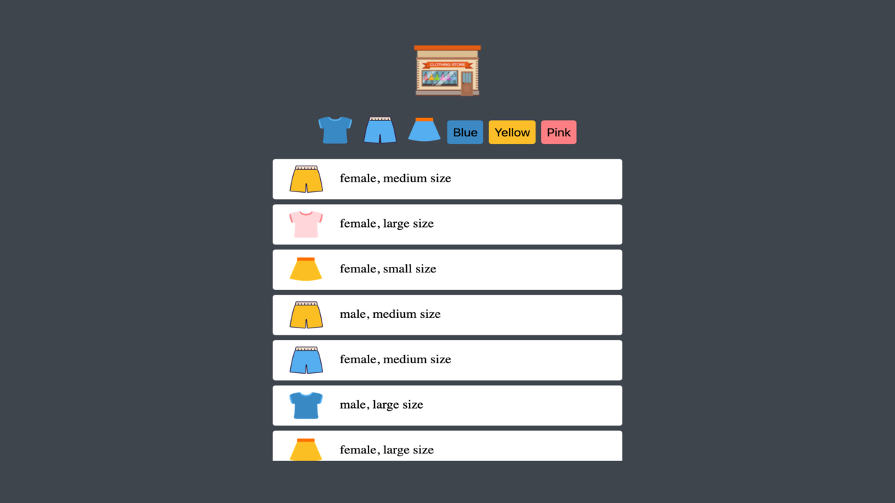
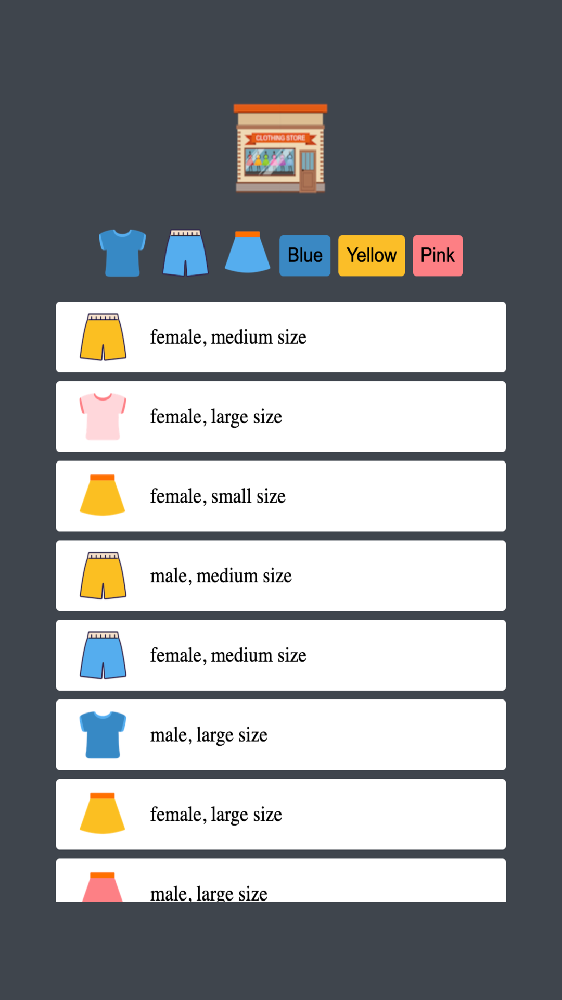

<div align="center">


# 🛍️ Sort & Shop - Online Shopping Mall Mini Game

</div>


> 🧩 Version 1.0.0 — Initial release with JSON-based filtering and offline PWA support.

A playful **mini web app** built with **HTML, CSS, and Vanilla JavaScript** — designed to practise essential JavaScript skills like fetching data, filtering items, and building a responsive, installable **PWA**.

## 🎮 Live Demo

🎥 **Watch the Demo:**  
[](https://www.loom.com/share/75b59ae495a04cb7b1fefb41af1aada7)

🔗 [**Try the Online Shopping Mall Game**](https://byte-nana.github.io/mini-shopping-mall-game/)

## 💡 Project Overview

This project showcases a beginner-to-intermediate understanding of **core front-end principles** while maintaining clean, modular code.  
Users can browse, sort, and filter clothing items by type or colour — a simple yet effective way to demonstrate **JavaScript logic, DOM manipulation, and responsive design.**

## 🎯 Learning Goals

- Practise **fetching and handling JSON data** using `fetch()` and Promises.
- Build a **dynamic UI** that updates without page reloads.
- Strengthen understanding of **filtering and conditional rendering**.
- Gain exposure to **PWA fundamentals** (manifest + service worker).
- Improve **mobile-first design** and accessibility awareness.

## 🧩 Features

| Feature                  | Description                                                      |
| :----------------------- | :--------------------------------------------------------------- |
| 🧍‍♀️ Interactive Filtering | Filter clothing by type or colour instantly.                     |
| ⚡ Dynamic Rendering     | All products are loaded from a JSON file rather than hard-coded. |
| 💾 Offline Support       | Installable as a PWA with service worker and manifest setup.     |
| 📱 Responsive Layout     | Adjusts smoothly across mobile and desktop screens.              |
| 🚨 Error Handling        | Displays a fallback image if data fails to load.                 |

## 🧠 Tech Stack

| Layer   | Technology                                               |
| :------ | :------------------------------------------------------- |
| Markup  | HTML5                                                    |
| Styling | CSS3 (Custom Properties, Transitions, Responsive Design) |
| Logic   | Vanilla JavaScript (ES6 Modules)                         |
| PWA     | Manifest + Service Worker (`pwabuilder-sw.js`)           |

## 📁 Folder Structure

```
.
├── css
│   └── style.css
├── data
│   └── data.json
├── icons
│   ├── any
│   │   ├── icon-192.png
│   │   ├── icon-512.png
│   │   └── icon.png
│   ├── apple-touch-icon.png
│   ├── favicon-96x96.png
│   ├── favicon.ico
│   └── maskable
│       ├── maskable-icon-192.png
│       ├── maskable-icon-512.png
│       └── maskable-icon.png
├── img
│   ├── logo.png
│   ├── screenshot_desktop.png
│   ├── screenshot_mobile.png
│   └── [other clothing images]
├── index.html
├── manifest.json
├── offline.html
├── pwabuilder-sw.js
└── src
    ├── main_refactor.js
    └── main.js
```

## 📸 Screenshots

|                       Desktop                       |                      Mobile                       |
| :-------------------------------------------------: | :-----------------------------------------------: |
|  |  |

## 🚀 Future Enhancements

- 🌈 Add hover animations and sound effects.
- 🧍‍♂️ Show item details in a modal pop-up.
- 🕶️ Introduce light/dark theme toggle.
- 💾 Save filter preferences in `localStorage`.

## 👩‍💻 About the Developer

**Developed by [Byte-nana](https://github.com/byte-nana)**  
An aspiring front-end developer passionate about blending **creative design**, **clean code**, and **accessible user experiences**.

## 📚 Reference & Inspiration

This project was inspired by [Ellie’s JavaScript Shopping Game Tutorial](https://www.youtube.com/watch?v=We2Kv1HMGvc).

## 🧾 Licence

Released under the [MIT Licence](LICENSE).

---

<div align="center">
  <sub>Made with ❤️ by Byte-nana in London • 2025</sub>
</div>
